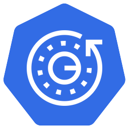

# Pod restarts



A `kubectl` [Krew](https://krew.dev) plugin to lists all restarts in your cluster and show you pods last start times.

Icon art made by [Pixelmeetup](https://www.flaticon.com/authors/pixelmeetup) from [Flaticon](https://www.flaticon.com/). [We had one before Krew itself](https://github.com/kubernetes-sigs/krew/issues/437), go figure.

## Quick Start

If you don't use Krew to manage `kubectl` plugins [you can simply download the binary here](https://github.com/caiobegotti/pod-restarts/releases) and put it in your PATH.

```
kubectl krew install pod-restarts
kubectl pod-restarts
```

## Why use it

Sometimes using a `kubectl` command is much faster than running a bunch of Prometheus graphs and only need a quick glance of what has been restarting lately or during a migration.

## What does it look like

```
This command prints a table with all the restarting pods inside
your cluster and the lookup can be restricted to a specific namespace, based
on a minimum threshold for restarts or just count containers restarts too.

The purpose of this is to have a glance at what has been failing and since
when, as age and start times are included in the result table. The alternative to
that would be to run multiple shell commands with complex parsing or plot N graphs
with Prometheus or other tool.

Usage:
  pod-restarts [flags]

Examples:

Cluster-wide listing
$ kubectl pod-restarts

Restricts listing to a namespace (faster in big clusters)
$ kubectl pod-restarts -n production

Ignores pods below a specific threshold (10 restarts)
$ kubectl pod-restarts -t 10

Also lists all the containers restarting inside the pods
$ kubectl pod-restarts -c

Flags:
  -c, --containers         Also lists containers restarts, ignoring thresholds
  -h, --help               help for pod-restarts
  -n, --namespace string   If present, the namespace scope for this CLI request
  -t, --threshold int32    Only list restarts above the given threshold
```

```
$ kubectl pod-restarts -c -n istio-system
NAMESPACE       RESTARTS    NAME                                      AGE    START
istio-system    4           istio-policy-86978d4c49-7wvdj/mixer       35s    2020-01-22 12:29:09 -0300 -03
istio-system    4           istio-policy-86978d4c49-v7fxb/mixer       15d    2020-01-22 12:29:12 -0300 -03
istio-system    5           istio-telemetry-7c5b6c9975-cj2vq/mixer    120d   2020-01-22 12:29:10 -0300 -03
istio-system    5           istio-telemetry-7c5b6c9975-h2c6s/mixer    120d   2020-01-22 12:29:15 -0300 -03
```

```
$ kubectl pod-restarts -n kafka
NAMESPACE    RESTARTS    NAME                                              AGE    START
kafka        7           kafka-operator-entity-operator-66d6d5965-zbwmq    72h    2020-01-22 12:29:11 -0300 -03
kafka        2           strimzi-topic-operator-6fc5484b85-996sx           90m    2020-01-22 12:29:11 -0300 -03

$ kubectl pod-restarts -n kafka -t 5
NAMESPACE    RESTARTS    NAME                                              AGE    START
kafka        7           kafka-operator-entity-operator-66d6d5965-zbwmq    72h    2020-01-22 12:29:11 -0300 -03
```